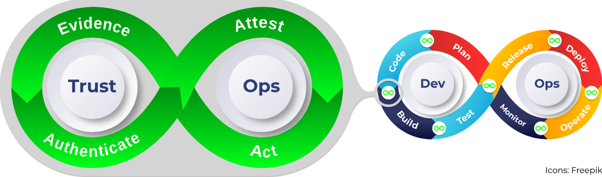
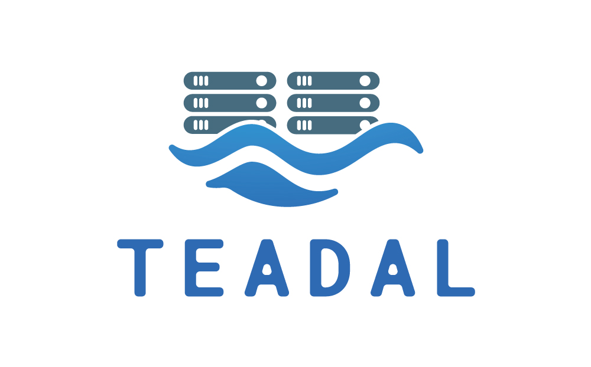

<!--Banner-->


<!--Header Name-->
<h1 align="center">TrustOps</h1>
<h4 align="center">Continuously Building Trustworthy
Software</h4>

<!--Start Intro-->               
<p align="left">
Software services play a crucial role in daily life, however, in how often do we really check if the software we are using is doing what it is supposed to do? Or if it was created by the people we think it was created by? Or if it is provided as promised by cloud or service providers?

We argue that gathering verifiable evidence during software development and operations is needed for creating a new trust model that can answer these questions without a doubt.
Therefore, we present TrustOps, an approach for continuously collecting verifiable evidence in all phases of the software life cycle, relying on and combining already existing tools and trust-enhancing technologies to do so. 
For this, we created this community, to collect and share tools, technologies, and best practices to make TrustOps a reality.
</p>

<!-- TODO: add doi and url to pre-print -->
For more details on the method find our paper [here]().
```bibtex
@inproceedings{trustOps,
    author = {Eduardo Brito and Fernando Castillo and Pille Pullonen-Raudvere and Sebastian Werner},
    title = {TrustOps: Continuously Building Trustworthy Software},
    booktitle = "Proceeding of the 28th International Conference on Enterprise Design, Operations and Computing",
    year = {2024},
}
```

For more information on TrustOps tools, practices, and technologies, please check out our [Awsome List]() and start contributing to the community.

<!--End Intro-->
---
<p align="left" style="font-size: 12px">

Funded in part by the European Union (TEADAL, 101070186). Views and opinions expressed are, however, those of the author(s) only and do not necessarily reflect those of the European Union. Neither the European Union nor the granting authority can be held responsible for them.
</p>


Joint work by CYBERNETICA AS and Information System Engineering Group, Technische Universität Berlin.




 
---
